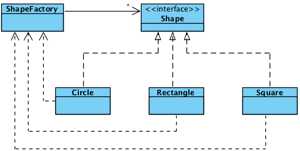

# Approaching Issues
Design Patterns are one of the few interesting things in Software development thanks to their dive into particular problem situations. But from what I understand, these situations are not to be directly compared to algorithms, and I hope to drive more into finding common solutions and strategies that would help fix problems that could arise during software development. 
## Tackling in Context:
An example of this could be the Creational Pattern. The main idea of this pattern is to allow an overall understanding of the specific parts of what was needed to build the software and how each part connects to the next. Part of this pattern is the Factory method is an interface that would help allow the creation of subclasses which would allow different objects to appear separate from each other. This could help in situations where you would need to create a variety of different things and be able to adjust on the fly without having to modify as much of the base program.  Do note however that this can create layers upon layers of classes and objects. As there would be a lot to keep in mind and to manage. If the object orientation needed doesn’t need to contain a ton of variation, simply creating an object would be a much simpler path. Something however that could also be used is the use of a more Composite Design Pattern. In a composite design pattern, we can take an instance and manipulate it in a way so other objects that would appear within the same instance would be reused and avoid having to differentiate between them and keep it overall uniform!

# Usage in Game Development!

In the usage of what was done in our project, so far, we are looking into the implementation of the Professor Trading Card Game! Currently, we have the process broken down into separate issues such as how the cards are built. With this, we attempted to build a system that focused on a Factory Pattern. For the cards, while not built like a constructor, follow an idea where we had the layout of where the cards have the common things like name, style, dimensions, and more. As every card would produce a slightly different appearance. Of course, each defined part would do a specific thing as it wouldn’t be returning everything but rather the specific ID element that would correlate to that person. This is what makes every person’s card collection profile unique in that it checks what cards they have and what cards they don’t have so that they don’t reveal card information that they haven’t seen. 
```cpp
<div class="container">
  <h1>Bootstrap Container</h1>
</div>
```
