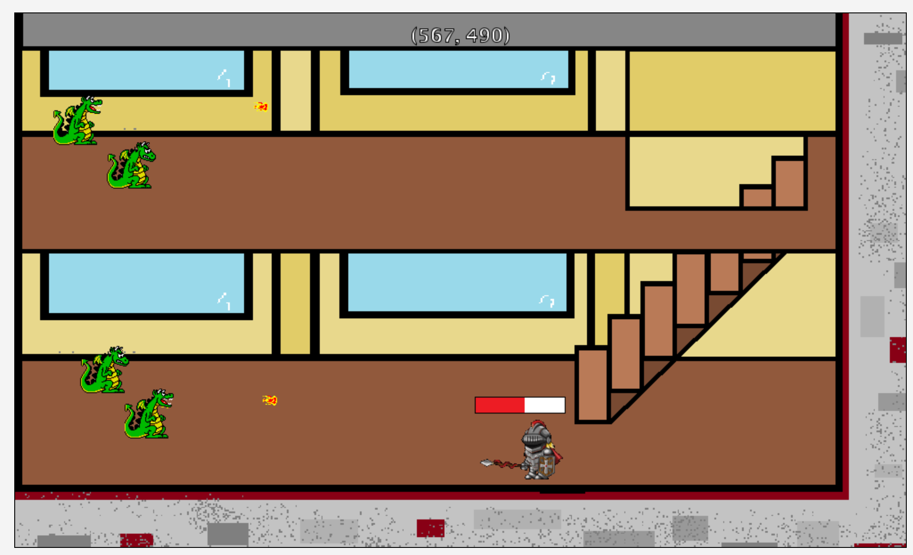

While not directly related to Computer Science, 3D animation is something I learned during my own time and I feel like with a computer science background, I could learn more from this class
to possibly gain more knowledge on how I could potentially apply technically towards a direction of interactive media! Here are a few examples of my work. Content like this is focused more on
animation, lighting, and depth.

<iframe width="1920" height="1080" 
  src="https://www.youtube.com/watch?v=o9o8Ux9i2Hk">
</iframe>
Source: <a href="[https://www.youtube.com/@Thermallax"><i class="large github icon "></i>Channel Source</a>

